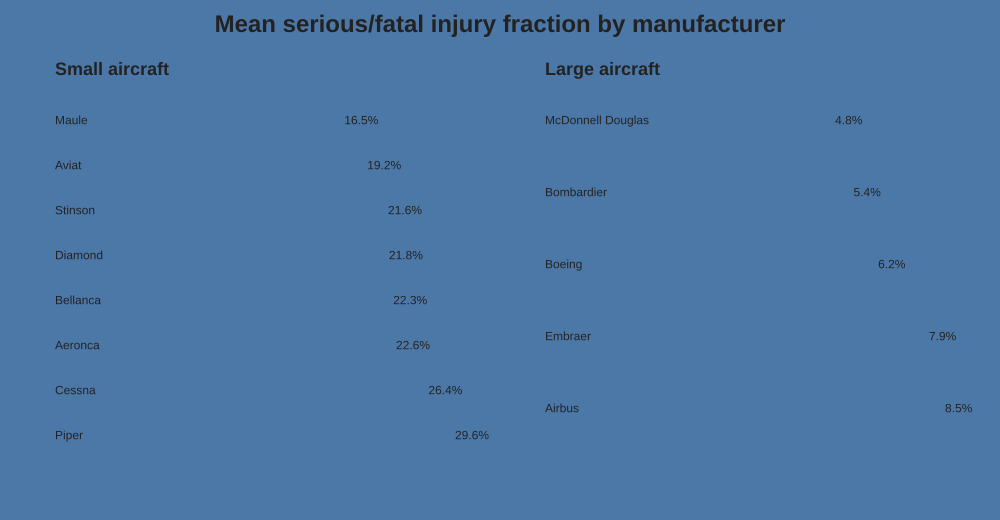
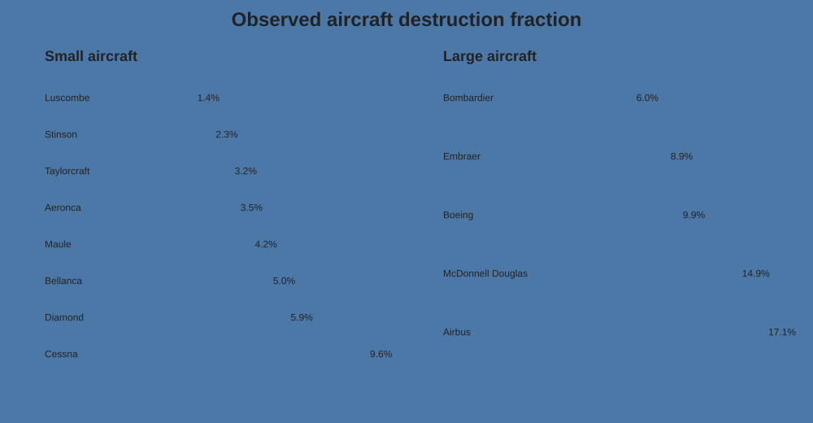
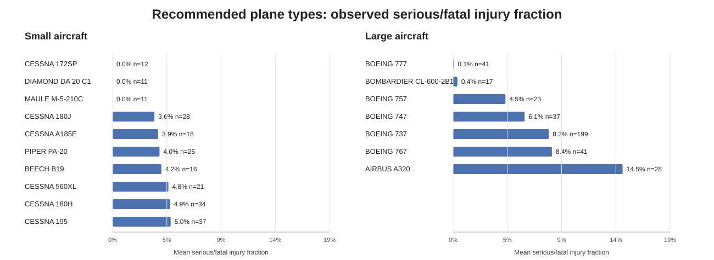
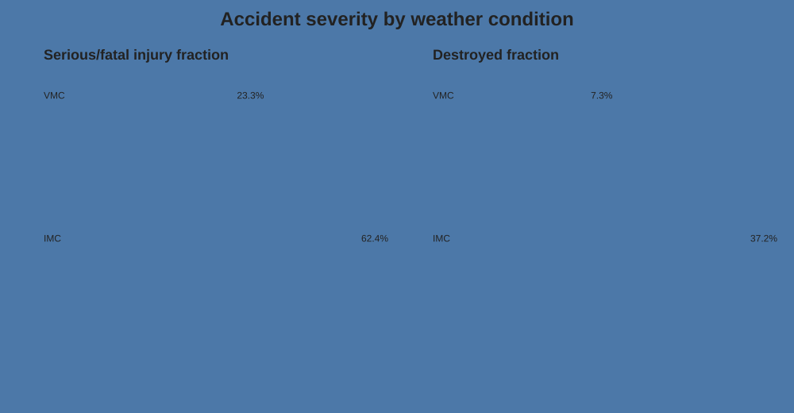
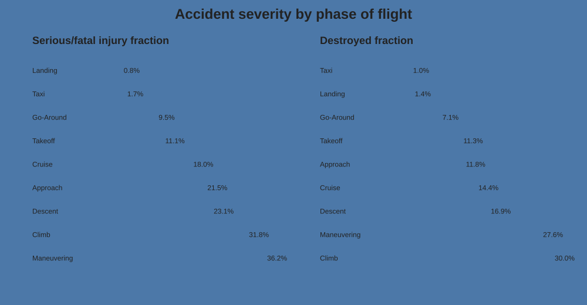

# Aviation Accident Safety Analysis

## Business Problem

This project evaluates aviation accident outcomes for an airline/aircraft insurer. The client wants aircraft makes and models that show comparatively low rates of **aircraft destruction** and low fractions of **serious or fatal occupant injuries** when accidents occur. The brief requires separate recommendations for smaller and larger aircraft and asks for evidence on other conditions associated with accident severity.

The analysis uses U.S. aviation accident/incident records covering 1948–2023. To match the client's scope, the working data is restricted to **professionally built airplanes from 1983 onward**.

> **Important:** this dataset contains accidents and incidents, not exposure hours or total flights. The findings describe severity **conditional on an event appearing in the accident dataset**. They should not be interpreted as the probability that a particular aircraft will have an accident.

## Business Questions

1. Which manufacturers have comparatively low serious/fatal injury and destruction rates?
2. Which specific small and large airplane types look strongest after enforcing minimum sample sizes?
3. How are weather conditions and phase of flight associated with injury severity and aircraft destruction?

## Data and Method

The source is the aviation accident dataset supplied for the Flatiron School summative lab. The raw file contains **88,889 rows and 31 columns**.

Cleaning and analysis decisions include:

- restrict `Aircraft.Category` to **Airplane**;
- restrict `Amateur.Built` to **No**;
- restrict events to **1983-01-01 or later**;
- estimate `Total.Occupants` as fatal + serious + minor + uninjured;
- create `Serious.Fatal.Fraction` as `(fatal + serious) / Total.Occupants`;
- create `Destroyed` as 1 for destroyed aircraft and 0 for substantial/minor damage, while leaving unknown damage missing;
- normalize manufacturer and model strings and create a unique `Plane.Type` identifier;
- keep manufacturers represented by at least **50 scoped events**;
- require at least **20 events** for manufacturer-level comparisons and at least **10 events** for make/model comparisons;
- classify plane types as small or large using a 20-occupant threshold applied to the plane type's mean observed occupancy.

After cleaning, **18,299** records remain.

## Key Findings

### 1. Manufacturer-level safety outcomes



For small-aircraft records, **Maule** provides one of the strongest balanced manufacturer-level profiles: 215 analyzed events, a mean serious/fatal injury fraction of about **16.5%**, and an observed destruction rate of about **4.2%**. **Stinson, Diamond, and Aeronca** also combine comparatively low injury severity with low destruction rates.

For large-aircraft records, only five manufacturers clear the robustness threshold. **Bombardier** has the lowest observed destruction fraction at about **6.0%** with a mean serious/fatal injury fraction near **5.4%**. **Boeing** has by far the largest large-aircraft sample and combines an injury fraction near **6.2%** with a destruction fraction near **9.9%**.



### 2. Specific aircraft recommendations



#### Large passenger aircraft

- **Boeing 777** — 41 usable injury records; mean serious/fatal injury fraction ≈ **0.07%**; destruction rate ≈ **4.8%** among 21 known-damage records.
- **Bombardier CL-600-2B19** — 17 injury records; mean injury fraction ≈ **0.36%**; **0 observed destroyed aircraft** among 13 known-damage records.
- **Boeing 757** — 23 injury records; mean injury fraction ≈ **4.5%**; 0 observed destroyed aircraft among 11 known-damage records.

**Primary large-aircraft recommendation: Boeing 777.** It combines the lowest observed injury severity among eligible large models with a larger sample than the other top-ranked models and a comparatively low destruction rate.

#### Small aircraft

- **Cessna 180J** — 28 injury records; mean serious/fatal fraction ≈ **3.6%**; no destroyed aircraft among 27 known-damage records.
- **Piper PA-20** — 25 injury records; mean serious/fatal fraction ≈ **4.0%**; no destroyed aircraft among 25 known-damage records.
- **Cessna 172SP**, **Diamond DA 20 C1**, and **Maule M-5-210C** each show zero observed serious/fatal injury fraction and zero observed destruction in 11–12-event samples. These are promising but less precise because the samples sit close to the minimum threshold.

**Primary small-aircraft recommendations: Cessna 180J and Piper PA-20**, with the smaller-sample models treated as secondary candidates for further underwriting review.

## Other Safety Factors

### Weather condition



Weather is strongly associated with severity in this accident sample. **VMC** records show a mean serious/fatal injury fraction around **23%** and destruction around **7%**. **IMC** records show a mean serious/fatal injury fraction around **62%** and destruction around **37%**. The IMC sample contains roughly 923 usable events, so the pattern is not driven by a handful of observations.

This is an association, not a causal estimate: aircraft type, mission, terrain, pilot qualifications, and accident mechanism may differ between IMC and VMC events.

### Phase of flight



Severity varies substantially by phase of flight. **Landing** accidents have a mean serious/fatal injury fraction below **1%** and destruction near **1.4%** in records with known phase. In contrast, **maneuvering** is around **36%** serious/fatal and **28%** destroyed, while **climb** is around **32%** serious/fatal and **30%** destroyed.

The phase field has substantial missingness, so these results describe only the subset with known phase.

## Recommendations to the Client

1. **Prioritize the Boeing 777 for large-aircraft underwriting review**, with the Bombardier CL-600-2B19 and Boeing 757 as additional candidates.
2. **Prioritize the Cessna 180J and Piper PA-20 for small-aircraft review** because they combine low observed injury severity with zero destruction in samples larger than the minimum model threshold.
3. **Treat IMC exposure as a major underwriting/operational risk signal.** Accident outcomes are materially more severe in IMC than VMC in this dataset.
4. **Account for operational phase in risk assessment.** Maneuvering and climb accidents have much more severe outcomes than landing and taxi events in the available phase data.
5. Use these results as screening evidence rather than a complete actuarial model. A production underwriting model should add flight-hours/departures exposure, aircraft age, maintenance history, pilot experience, geography, and mission profile.

## Repository Structure

```text
dsc-course0-m8-lab/
├── Aviation_Accidents_Cleaning.ipynb
├── Aviation_Accidents_Data_Analysis.ipynb
├── README.md
├── data/
│   ├── AviationData.csv
│   └── USState_Codes.csv
└── images/
    ├── make_injury_comparison.svg
    ├── make_destruction_comparison.svg
    ├── model_recommendations.svg
    ├── weather_safety.svg
    └── phase_safety.svg
```

The cleaning notebook generates `data/AviationData_cleaned.csv`, which is then loaded by the analysis notebook.

## How to Run

1. Clone the repository.
2. Open `Aviation_Accidents_Cleaning.ipynb` and run all cells. This creates `data/AviationData_cleaned.csv`.
3. Open `Aviation_Accidents_Data_Analysis.ipynb` and run all cells.
4. Review the generated tables and visualizations alongside the written interpretations.

## Tools

Python, Pandas, NumPy, Matplotlib, Seaborn, Jupyter Notebook.

## Author

Steven Rouse
